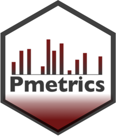
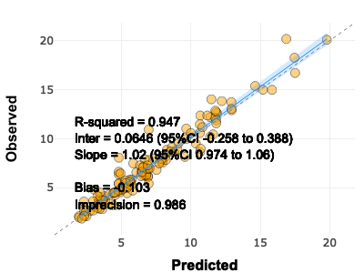

<!-- README.md is generated from README.Rmd. Please edit that file -->

# Pmetrics <a href="https://lapkb.github.io/Pmetrics/"></a>

Thank you for your interest in Pmetrics. Pmetrics is a library package
for R to perform non-parametric and parametric
pharmacokinetic-pharmacodynamic population and individual modeling and
simulation. It is primarily designed for pharmacometric researchers.

Pmetrics is based on over 35 years of research by our laboratory and is
the most mature non-parametric method available. Nevertheless, Pmetrics
is dynamically evolving. Best of all, it is SHAREWARE with only a
suggested donation.

More information about Pmetrics is available at the [Laboratory of
Applied Pharmacokinetics and
Bioinformatics](http://www.lapk.org/Pmetrics.php).

## Installation

You can install the development version of Pmetrics from
[GitHub](https://github.com/) with:

``` r
# install.packages("devtools")
devtools::install_github("LAPKB/Pmetrics")
```

## Example

Fit data and generate plots:

``` r
library(Pmetrics)
NPex$op$plot()
```



Simulate:

``` r
simEx$plot()
```

And more!
