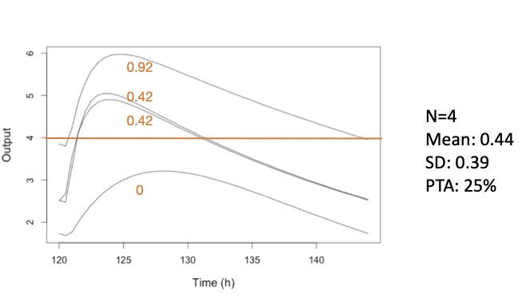

# Probability of Target Attainment

``` r
library(Pmetrics)
```

## Introduction

Probability of target attainment (PTA) is a powerful application of
simulated results. The idea is to calculate the proportion of simulated
profiles corresponding to a particular dosage regimen which meet given
criteria for “success”.

For example, it could be a certain AUC or time above a threshold. Below
is a simple figure showing 4 concentration-time profiles after a given
dosage. If the target is percent of the dosing interval \> 4 mg/L of at
least 60% (0.6), then only one of the 4 curves meets this threshold, and
the PTA is 25%. We can also generate the mean (44%) and standard
deviation (39%) of the % time above 4 mg/L, also called the
pharmacodynamic index (PDI) for this dosage.



Of course we usually simulate far more than 4 profiles! Below is the
same dosage and target for 1000 profiles.


## Creation

Pmetrics allows you to create a PTA in two ways.

- Use the `$pta()` method attached to
  [`PM_sim()`](https://lapkb.github.io/Pmetrics_rust/reference/PM_sim.md)
  objects.
- Use `PM_pta$new()`.

The only difference between these two is that with the first, you do not
have to supply the name of your simulation object because you are
operating upon it already.

Below is example code to create a PTA. Refer to
[makePTA](https://lapkb.github.io/Pmetrics/reference/makePTA.html) for
details on the arguments to the method.

``` r
# first define labels for simulated regimens
simlabels <- c("600 mg daily", "1200 mg daily", "300 mg bid", "600 mg bid")

# using a previously created simulation built into Pmetrics
pta1 <- simEx$pta(
  simlabels = simlabels,
  target = c(0.25, 0.5, 1, 2, 4, 8, 16, 32, 64), target_type = "time",
  success = 0.6, start = 120, end = 144
)

# using a sampled distribution of MICs from EUCAST
# for E.coli and piperacillin
# https://mic.eucast.org/search/

pip_ecoli <- data.frame(
  mic = c(0.25, 0.5, 1, 2, 4, 8, 16, 32, 64),
  n = c(38, 312, 4820, 6883, 1214, 382, 776, 1335, 1137)
)

pta2 <- simEx$pta(
  simlabels = simlabels,
  target = makePTAtarget(pip_ecoli),
  target_type = "time",
  success = 0.6, start = 120, end = 144
)

# combined targets with minimum concentration >5 and <10
pta3 <- PM_pta$new(simEx,
  simlabels = c("600 mg daily", "1200 mg daily", "300 mg bid", "600 mg bid"),
  target = list(5, 10),
  target_type = c("min", "-min"),
  success = c(1, 1),
  start = 120, end = 144
)

# AUC:MIC >200 for distribution of MICs
pta4 <- PM_pta$new(simEx,
  simlabels = c("600 mg daily", "1200 mg daily", "300 mg bid", "600 mg bid"),
  target = makePTAtarget(pip_ecoli),
  target_type = "auc",
  success = 200,
  start = 120, end = 144
)

# Combined target with AUC:MIC >200 for distribution of MICs and minimum concentration >1
pta5 <- PM_pta$new(
  simdata = simEx,
  simlabels = c("600 mg daily", "1200 mg daily", "300 mg bid", "600 mg bid"),
  target = list(makePTAtarget(pip_ecoli), 5),
  target_type = c("auc", "min"),
  success = c(200, 1),
  start = 120, end = 144
)
```

**Some things to point out…**

We’ll say again that you must supply simulation data, which has been
previously generated. If you use the `PM_sim$pta()` method, the
simulation data are embedded in the object. If you use `PM_pta$new()`,
you have to supply the name of a `PM_sim` object or a previously saved
.rds file yourself.

Details of key arguments follow.

- **simlabels** Optional character vector of labels for each simulation
  (i.e. subject in the data template). Default is
  `c("Regimen 1", "Regimen 2",...)`.
- **target** One of several options.
  - A vector of pharmacodynamic targets, such as Minimum Inhibitory
    Concentrations (MICs), e.g. `c(0.25, 0.5, 1, 2, 4, 8, 16, 32)`.
  - A single numerical value such as a concentration, e.g. 10.
  - A sampled distribution using
    [`makePTAtarget()`](https://lapkb.github.io/Pmetrics_rust/reference/makePTAtarget.md).
  - A list of multiple targets combining the above if multiple
    `target_type`s are used. If so, the first `target` can be a vector,
    but subsequent targets must be single values to avoid factorial
    expansion of combinations. For example, the first target could be a
    vector of MICs corresponding to a `target_type` of “time”, the
    second target a value of 10 corresponding to a `target_type` of
    “min”, and the third target a value of 50 corresponding to a
    `target_type` of “max”:
    `target = list(c(0.25, 0.5, 1, 2, 4, 8, 16, 32), 10, 50)`. The first
    value can also be a sampled distribution made with
    \[makePTAtarget\]. For any, place a minus sign in front to make the
    success less than the target ratio,
    e.g. `target_type = c("min", "-min")`.
- **target_type** A vector of the type for each `target`. Available
  types:
- “time” is percent time above `target` within the time range specified
  by `start` and `end`
- “auc” is ratio of area under the curve within the time range to
  `target`
- “peak” or “max”, ratio of peak/max (synonymous) concentration to
  `target` within the time range.
- “min”, is the ratio of minimum concentration to `target` within the
  time range.
- A single numeric value, which must correspond to an observation time
  common to all PMsim objects in `simdata`, rounded to the nearest hour.
  In this case, the target statistic will be the ratio of observation at
  that time to `target`. This enables testing of a specific timed
  concentration (e.g. one hour after a dose or C1). Be sure that the
  time in the simulated data is used, e.g., 122 after a dose given at
  120.
- **success** A vector specifying the success statistics, e.g. 0.4 for
  proportion time (end-start) above target, and/or 100 for max:target.
  For example `success = 0.4` or `success = c(0.4, 100)`. The length
  must be the same as for `target` and `target_type`.

The created object `pta1` is a
[`PM_pta()`](https://lapkb.github.io/Pmetrics_rust/reference/PM_pta.md)
object, which has one data field named “results”, which is a list of
class *PMpta*, and each `target_type` is an element of the list,
followed by a final `intersection` element showing the results for
profiles which meet ALL the conditions (intersection) or `NA` if only
one `target_type` was specified. The individual elements are tibbles
with all possible combinations of `target`s and simulated regimens for a
given `target_type`. The tibbles have the following columns: \*
**sim_num** The simulation number in `simdata`. \* **label** Annotation
of the simulation, supplied by the `simlabels` argument. \* **target**
is the specified `target` for the results row. If a distribution created
by
[`makePTAtarget()`](https://lapkb.github.io/Pmetrics_rust/reference/makePTAtarget.md),
this will be a tibble with the simulated targets \* **type** is the
specified `target_type` for the results row \* **success_ratio** The
specified `success` metric for the results row \* **prop_success** The
proportion of profiles meeting the `success_ratio` for the results row
\* **success** A tibble of success (1) or not (0) for each profile for
the results row \* **pdi** A tibble of the pharmacodynamic index,
i.e. the ratio or time above for each profile for the results row \*
**start** The start time used for the results row \* **end** The end
time used for the results row. For the `$intersect` item in the return
list, the columns are the same, but the `target` and `target_type` will
reflect all requested values expressed in parenthetical multiplication
format to emphasize intersection, e.g., (auc)(min). Simulated (rather
than discrete) targets made with
[`makePTAtarget()`](https://lapkb.github.io/Pmetrics_rust/reference/makePTAtarget.md)
will be abbreviated as “(sim)”, e.g. (sim)(5) for a combination of
simulated targets and a single concentration target of 5.

It also has several methods:

- **clone()** to make a copy.
- **save()** to save as an .rds file. Load a previously saved file with
  `PM_pta$new()` and supply the filename as the argument.
- **plot()** to call
  [`plot.PM_pta()`](https://lapkb.github.io/Pmetrics_rust/reference/plot.PM_pta.md).
- **summary()** to call `summary.PMpta()`

## Plotting

The most basic plot is achieved with a simple call to the method.

``` r
pta1$plot() # no intersection so plot the first and only pta
pta3$plot() # plot the intersection by default
pta3$plot(at = 1) # plot just the first target pta
```

The `at` argument controls which object in the list is plotted, by
default the intersection, or the first object (`at = 1`) if there is no
intersection. Notice the difference between the plots, according to
whether `target` was discrete or from a distribution. The latter plot is
also known as a “Cumulative Fractional Response” or CFR, which is the
proportion of a population achieving a response for a give dosage with a
distribution of target values in that population.

There are many ways to modify the plot, consistent with other Pmetrics
plots which use the *plotly* package and all detailed in the help for
[`plot.PM_data()`](https://lapkb.github.io/Pmetrics_rust/reference/plot.PM_data.md).
For example,

``` r
p <- pta1$plot(
  line = list(color = "Set1", width = 3),
  xlab = list(text = "MIC mg/L", font = list(size = 20)),
  ylab = "Proportion with %T>MIC ≥ 60%",
  xaxis = list(tickfont = list(size = 18)),
  yaxis = list(tickfont = list(size = 18)),
  legend = list(font = list(size = 18)),
  marker = list(size = 16)
)
```

Here’s more advanced plotly. Here we take the previous plot `p` and add
bars to it to represent the frequency distribution of piperacillin MICs
for E. Coli from EUCAST. We use our `pip_ecoli` data frame, the MICs for
the x-axis, and the normalized counts for frequencies. We re-define the
y-axis labels using some CSS/HTML to color individual portions. This is
quite advanced plotly!

``` r
p %>%
  plotly::add_bars(
    x = ~mic,
    y = ~ round(n / sum(n), 2),
    marker = list(opacity = 0.6, color = "Dodgerblue"),
    name = "MIC",
    data = pip_ecoli,
    width = ~ mic * 0.2,
    showlegend = FALSE,
    inherit = FALSE
  ) %>%
  plotly::layout(
    yaxis = list(
      title =
        list(text = "<b>Proportion with %T>MIC ≥ 60%<br><span style='color:Dodgerblue; opacity:0.6'>MIC Frequency</span></b>")
    ),
    font = list(size = 10)
  )
```

## Summarizing

Like most created Pmetrics objects,
[`PM_pta()`](https://lapkb.github.io/Pmetrics_rust/reference/PM_pta.md)
objects can be summarized.

``` r
pta1$summary()
#> # A tibble: 36 × 5
#>    reg_num label         target type  prop_success
#>      <int> <chr>          <dbl> <chr>        <dbl>
#>  1       1 600 mg daily    0.25 time         1    
#>  2       1 600 mg daily    0.5  time         1    
#>  3       1 600 mg daily    1    time         1    
#>  4       1 600 mg daily    2    time         0.998
#>  5       1 600 mg daily    4    time         0.819
#>  6       1 600 mg daily    8    time         0.343
#>  7       1 600 mg daily   16    time         0.028
#>  8       1 600 mg daily   32    time         0    
#>  9       1 600 mg daily   64    time         0    
#> 10       2 1200 mg daily   0.25 time         1    
#> # ℹ 26 more rows
pta3$summary(at = 2) # summarize the second target pta
#> # A tibble: 4 × 12
#>   reg_num label   target type  prop_success median lower upper  mean    sd   min
#>     <int> <chr>    <dbl> <chr>        <dbl>  <dbl> <dbl> <dbl> <dbl> <dbl> <dbl>
#> 1       1 600 mg…     10 -min         0.933  0.387 0.185  1.19 0.483 0.277 0.140
#> 2       2 1200 m…     10 -min         0.634  0.774 0.369  2.37 0.966 0.555 0.279
#> 3       3 300 mg…     10 -min         0.867  0.575 0.277  1.43 0.647 0.314 0.225
#> 4       4 600 mg…     10 -min         0.429  1.15  0.554  2.86 1.29  0.627 0.450
#> # ℹ 1 more variable: max <dbl>
pta3$summary() # summarize the intersection pta
#> # A tibble: 4 × 5
#>   reg_num label         target  type        prop_success
#>     <int> <chr>         <chr>   <chr>              <dbl>
#> 1       1 600 mg daily  (5)(10) (min)(-min)        0.299
#> 2       2 1200 mg daily (5)(10) (min)(-min)        0.443
#> 3       3 300 mg bid    (5)(10) (min)(-min)        0.438
#> 4       4 600 mg bid    (5)(10) (min)(-min)        0.425
```

Here the default for at is 1, because this function prouduces a summary
of the pharmacodynamic index values, which cannot be calculated for the
intersection when there is more than one `target_type`. The output is a
tibble with the following columns (only the first three if
`at = "intersect"`): \* **sim_num** is the number of the simulation \*
**target** is the target for the row, if targets are discrete, not used
for simulated targets \* **label** is the simulation label, for
reference \* **prop_success** is the proportion of simulated profiles
that met the success definition \* **median** is the median
parmacodynamic index (PDI), i.e. the proportion or ratio depending on
the target type \* **lower** is the lower bound of the interval defined
by `ci` \* **upper** is the upper bound of the interval defined by `ci`
\* **mean** is the mean of the PDI \* **sd** is the standard deviation
of the PDI \* **min** is the minimum PDI \* **max** is the maximum PDI

``` r
pta1$summary(ci = 0.9)
#> # A tibble: 36 × 5
#>    reg_num label         target type  prop_success
#>      <int> <chr>          <dbl> <chr>        <dbl>
#>  1       1 600 mg daily    0.25 time         1    
#>  2       1 600 mg daily    0.5  time         1    
#>  3       1 600 mg daily    1    time         1    
#>  4       1 600 mg daily    2    time         0.998
#>  5       1 600 mg daily    4    time         0.819
#>  6       1 600 mg daily    8    time         0.343
#>  7       1 600 mg daily   16    time         0.028
#>  8       1 600 mg daily   32    time         0    
#>  9       1 600 mg daily   64    time         0    
#> 10       2 1200 mg daily   0.25 time         1    
#> # ℹ 26 more rows
```
