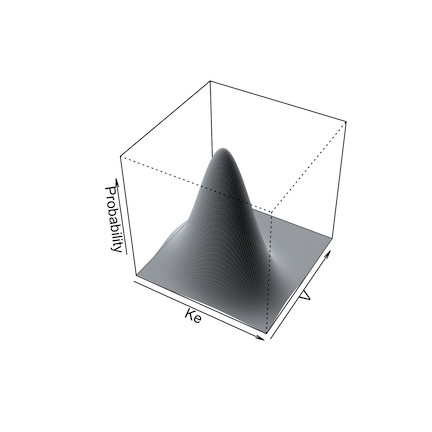
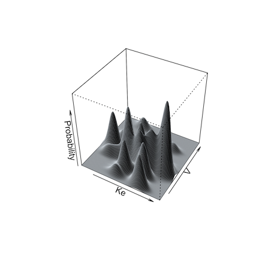

# Simulation

## 1 Introduction to simulations

The Pmetrics simulator is a powerful Monte Carlo engine that is smoothly
integrated with Pmetrics inputs and outputs.

The simulator needs **3 mandatory inputs**:

1.  *Data*, which serves as the template providing inputs (e.g. doses)
    and outputs (e.g. concentrations)
2.  *Model*, which provides the equations
3.  *Joint probability value distributions for the parameters in the
    model*, i.e., the prior distribution from which to sample parameter
    values

There are **two ways to call the simulator**, which we discuss in more
detail below.

1.  Use the `$sim()` method with a
    [`PM_result`](https://lapkb.github.io/Pmetrics/reference/PM_result.html)
    object, e.g. `run1 <- PM_load(1); sim1 <- run1$sim(...)`
2.  Use
    [`PM_sim`](https://lapkb.github.io/Pmetrics/reference/PM_sim.html)
    directly, e.g. `sim2 <- PM_sim$new(...)`

Whether you use `PM_result$sim()` or `PM_sim$new()`, unlike the prior
versions of Pmetrics, you do not need to read the simulator output files
with `SIMparse`; Pmetrics does that for you automatically and returns
the `PM_sim` object.

## 2 Simulator input details

### 2.1 Data

The data template for a simulation is a
[`PM_data`](https://lapkb.github.io/Pmetrics/reference/PM_data.html)
object, with exactly the same structure as used for fitting models. This
template contains the dosing and observation history as well as any
covariates for each subject to be simulated. Each subject in the data
template will serve as a template for `nsim` simulated profiles. You can
supply the `PM_data` object in a number of ways.

- Use a previously created `PM_data` object, usually from an appropriate
  file with `PM_data$new("filename")` but could be created with the
  `$addEvent()` method (see
  [data](https://lapkb.github.io/Pmetrics_rust/articles/data.md) for
  details) or by creating an appropriate data frame in R and passing it
  to `PM_data$new()`.
- Provide the name of an appropriate data file with path if needed. Use
  [`getwd`](https://rdrr.io/pkg/base/man/getwd.html) and
  [`list.files`](https://rdrr.io/pkg/base/man/list.files.html) to ensure
  the path and filename are correct.
- If using `PM_result$sim()`, omit the `data` argument to use the data
  in the `PM_result` as the template.

When simulating, observation values (the `OUT` column) for `EVID=0`
events in the template can take any value, which will be replaced with
the simulated values. This includes observations coded as missing,
`OUT = -99`, or censored, `CENS = 1` or `CENS = -1`. Such scenarios are
only expected if using the data from a `PM_result`,method 1 above to
call the simulator. When making a new template, a good choice is
`OUT = -1` to remind you that it is being simulated, but this value is
optional.

You can have any number of subject records within a data template, each
with its own doses, dose times, observation times, and covariate values
if applicable. Each subject will generate as many simulated profiles as
you specify. You can control which subjects in the template are used and
how many are simulated with the `include`, `exclude`, and `nsim`
arguments to the simulator (see below). The first two arguments specify
which subjects in the data object will serve as templates for
simulation. The second specifies how many profiles are to be generated
from each included subject.

### 2.2 Model

Analogous to the data template, the model for a simulation is a
[`PM_model`](https://lapkb.github.io/Pmetrics/reference/PM_model.html)
object, with exactly the same structure as used for fitting. You can
supply the `PM_model` object in a number of ways.

- Use a previously created `PM_model` object, either from an appropriate
  file with `PM_model$new("filename")` but also by defining a model list
  directly in R (see
  [models](https://lapkb.github.io/Pmetrics_rust/articles/models.md) for
  details) passing it to `PM_model$new()`.
- Provide the name of an appropriate model file with path if needed. Use
  [`getwd`](https://rdrr.io/pkg/base/man/getwd.html) and
  [`list.files`](https://rdrr.io/pkg/base/man/list.files.html) to ensure
  the path and filename are correct.
- If using `PM_result$sim()`, omit the `model` argument to use the model
  in the `PM_result` as the template.

The model primary (random) parameters must match the parameters in the
`poppar` argument (see below). Any covariates in model equations must be
included in the data template.

### 2.3 Population parameter distribution

The other mandatory item is a prior probability distribution for all
random parameter values in the model. Pmetrics draws samples from this
distribution to create the simulated output. You can supply the `poppar`
prior object with the population parameters in a number of ways.

- Use a previously created
  [`PM_final`](https://lapkb.github.io/Pmetrics/reference/PM_final.html)
  object which is a field in a `PM_result` object,
  e.g. `run1 <- PM_load(1); poppar <- run1$final`.
- If using `PM_result$sim()`, omit the `poppar` argument to use the
  `PM_final` object in the `PM_result`.
- Create a `poppar` list directly in R, which is detailed below.

#### 2.3.1 Details on manually specifying `poppar`

This is a flexible but somewhat complex means of creating a prior
without a previous Pmetrics fit. It is suitable for lifting priors from
published models or other sources. A manually specified prior as a list
containing the following named items:

- **wt** vector of weights (probabilities) of sampling from each
  distribution. If missing, assumed to be 1. If only one distribution is
  to be specified the`wt` vector can be omitted or should be `wt = 1`.
  If multiple distributions are to be sampled, the `wt` vector should be
  of length equal to the number of distributions in `mean` and the
  values of `wt` should sum to 1, e.g. `wt = c(0.25, 0.05, 0.7)`.
- **mean** a list of mean parameter values. Each element of the list
  should be named with the parameter name and be a vector of length
  equal to the number of distributions.
- **sd** an optional named list of overall standard deviations for each
  parameter, considering parameters as unimodally distributed,
  i.e. there should only be one value for each parameter, regardless of
  the number of distributions. `sd` is only needed if a correlation
  matrix is specified, which will be converted to a covariance matrix.
- **ONE** of the following matrices:
  1.  **cor** A square matrix of the overall correlations between
      parameters, again considered as unimodally distributed, i.e. there
      should only be one correlation matrix regardless of the number of
      distributions. If a correlation matrix is specified, the `sd`
      element is required to calculate the covariance matrix.
  2.  **cov** A square matrix of the overall covariances between
      parameters, again considered as unimodally distributed, i.e. there
      should only be one covariance matrix regardless of the number of
      distributions. If a covariance matrix is specified, the `sd`
      element is unnecessary, since the diagonals of the covariance
      matrix are the variances or squared standard deviations. The
      covariance matrix, whether specified as `cov` or as a combination
      of `cor` and `sd`, will be divided by the number of distributions,
      i.e. `length(wt)`, and applied to each distribution.

**Examples** of manually specifying `poppar`:

- Single distribution:

  ``` r
    poppar = list(wt = 1, 
              mean = list(ke = 0.5, v = 100), 
              cov = matrix(c(0.04, 2.4, 2.8, 400), nrow = 2))  
  ```

**Notes:** Here, `sd` is not required because `cov` was specified.

- Multiple distributions:

  ``` r
    poppar = list(wt = c(0.1, 0.15, 0.75), # 3 distributions that sum to 1
              mean = list(ke = c(2, 0.5, 1), v = c(50, 100, 200)), # 3 values for each parameter
              sd = list(ke = 0.2, v = 20), # overall sd, ignoring multiple distributions
              cor = matrix(c(1, 0.6, 0.7, 1), nrow = 2)) 
              # sd required because cor specified
  ```

**Notes:**

## 3 Details on running the simulator

You run the simulator in two ways.

- Use the `$sim()` method for
  [`PM_result()`](https://lapkb.github.io/Pmetrics_rust/reference/PM_result.md)
  objects. This takes `poppar` from the `PM_result$final` field and the
  model from the `PM_result$model` field, so only a data object needs to
  be specified at minimum. If no data object is specified, it will use
  the `PM_result$data` as a template, i.e. the same data used to fit the
  model. An example is below. You don’t have to supply the model or
  `poppar`, because they are included in `run1`, with `poppar` taken
  from the `run$final` field. Supplying a different `PM_data` object as
  `dat` allows you to use the model and population prior from `run1`
  with a different dosing and observation data template. If you omit
  `dat` in this example, the original data in `run1` would serve as the
  template.

``` r
run1 <- PM_load(1)
sim1 <- run1$sim(data = dat, nsim = 100, limits = NA)
```

- Use `PM_sim$new()`. This simulates without necessarily having
  completed a fitting run previously, i.e., there may be no
  [`PM_result()`](https://lapkb.github.io/Pmetrics_rust/reference/PM_result.md)
  object. Here, you manually specify values for `poppar`, `model`, and
  `data`. These can be other Pmetrics objects, or de novo, which can be
  useful for simulating from models reported in the literature. An
  example is below.

``` r
sim2 <- PM_sim$new(poppar = run2$final, data = dat, model = mod1, ...)
```

Now you must include all three of the mandatory arguments: `model`,
`data`, and `poppar`. In this case we used the
[`PM_final()`](https://lapkb.github.io/Pmetrics_rust/reference/PM_final.md)
object from a different run (`run2`) as the `poppar`, but we could also
specify `poppar` as a list, for example. See `SIMrun()` for details on
constructing a manual `poppar`.

``` r
poppar <- list(wt = 1, mean = c(0.7, 100), covar = diag(c(0.25, 900)))
```

Under the hood, both of these calls to the simulator use the Legacy
`SIMrun()` function, and thus all its arguments are available when using
`PM_result$sim(...)` or `PM_sim$new(...)`.

## 4 Simulation options

Details of all arguments available to modify simulations are available
by typing `?SIMrun` into the R console or reading the documentation for
`SIMrun()`. A few are highlighted here.

Simulation from a non-parametric prior distribution (from NPAG) can be
done in one of two ways. The first is simply to take the mean and
covariance matrix of the distribution and perform a standard Monte Carlo
simulation. This is accomplished by setting `split = FALSE` as an
argument.

The second way is what we call semi-parametric ([Goutelle et al.
2022](#ref-goutelle_nonparametric_2022)). In this method, the
non-parametric “support points” in the population model, each a vector
of one value for each parameter in the model and the associated
probability of that set of parameter values, serve as the mean of one
multi-variate normal distribution in a multi-modal, multi-variate joint
distribution. The weight of each multi-variate distribution is equal to
the probability of the point. The overall population covariance matrix
is divided by the number of support points and applied to each
distribution for sampling.

Below are illustrations of simulations with a single mean and covariance
for two parameters (left, `split = FALSE`), and with multi-modal
sampling (right, `split = TRUE`).



Limits may be specified for truncated parameter ranges to avoid extreme
or inappropriately negative values. The simulator will report values for
the total number of simulated profiles needed to generate `nsim`
profiles within the specified limits, as well as the means and standard
deviations of the simulated parameters to check for simulator accuracy.

Output from the simulator can be controlled by further arguments passed
to `SIMrun()`. If `makecsv` is supplied, a .csv file with the simulated
profiles will be created with the name as specified by `makecsv`;
otherwise, there will be no .csv file created. If `outname` is supplied,
the simulated values and parameters will be saved in a .txt file whose
name is that specified by `outname`; otherwise the filename will be
“simout”. In either case, integers 1 to the number of subjects will be
appended to outname or “simout”, e.g. “simout1.txt”, “simout2.txt”.

## 5 Simulation output

In R6, simulation output files (e.g. *simout1.txt*, *simout2.txt*) are
automatically read by `SIMparse()` and returned as the new
[`PM_sim()`](https://lapkb.github.io/Pmetrics_rust/reference/PM_sim.md)
object that was assigned to contain the results of the simulation. All
files will remain on the hard drive. You no longer need to use
`SIMparse()` as Pmetrics will do it for you. This is unlike the Legacy
requirement for you to specifically read the output files from the
simulator with `SIMparse()`.

If you simulated from a template with multiple subjects, you will have a
simulation output from each template, and each will have `nsim`
profiles. If you wish to combine all the simulations into one
[`PM_sim()`](https://lapkb.github.io/Pmetrics_rust/reference/PM_sim.md)
object, use the argument `combine` in your call to the simulator run
methods. It will be passed to `SIMparse()` during the post-simulation
processing.

So if our data template has 3 subjects…

``` r
sim1 <- run1$sim(data = dat) # sim1 is a PM_sim with 3 simulation results
sim2 <- run1$sim(data = dat, combine = TRUE) # sim2 is a PM_sim with combined results
```

[`PM_sim()`](https://lapkb.github.io/Pmetrics_rust/reference/PM_sim.md)
objects have 6 data fields and 6 methods.

### 5.1 Data fields

Data fields are accessed with `$`, e.g. `sim1$obs`.

- **amt** A data frame with the amount of drug in each compartment for
  each template subject at each time.
- **obs** A data frame with the simulated observations for each subject,
  time and output equation.
- **parValues** A data frame with the simulated parameter values for
  each subject.
- **totalCov** The covariance matrix of all simulated parameter values,
  including those that were discarded to be within any `limits`
  specified.
- **totalMeans** The means of all simulated parameter values, including
  those that were discarded to be within any `limits` specified.
- **totalSets** The number of simulated sets of parameter values,
  including those that were discarded to be within any `limits`
  specified. This number will always be ≥ `nsim`.

All of these are detailed further in `SIMparse()`.

### 5.2 Methods

Methods are accessed with `$` and include parentheses to indicate a
function, possibly with arguments e.g. `sim1$auc()` or
`sim1$save("sim1.rds")`.

- **auc** Call
  [`makeAUC()`](https://lapkb.github.io/Pmetrics_rust/reference/makeAUC.md)
  to calculate the area under the curve from the simulated data.
- **pta** Call `makePTA()` to perform a probability of target attainment
  analysis with the simulated data.
- **plot** Call
  [`plot.PM_sim()`](https://lapkb.github.io/Pmetrics_rust/reference/plot.PM_sim.md)
  to plot the simulated data.
- **summary** Summarize any data field with or without grouping.
- **save** Save the simulation to your hard drive as an .rds file. Load
  a previous one by providing the filename as the argument to
  `PM_sim$new()`.
- **clone** Copy a simulation result.

All of these are detailed further in
[`PM_sim()`](https://lapkb.github.io/Pmetrics_rust/reference/PM_sim.md).To
apply them to one of the simulations when there are multiple, use `at`
followed by additional arguments to the method to choose the simulation.

``` r
sim1$plot(at = 2, ...)
```

## 6 Citations

Goutelle, Sylvain, Jean‐Baptiste Woillard, Michael Neely, Walter Yamada,
and Laurent Bourguignon. 2022. “Nonparametric Methods in Population
Pharmacokinetics.” *The Journal of Clinical Pharmacology* 62 (2):
142–57. <https://doi.org/10.1002/jcph.1650>.
