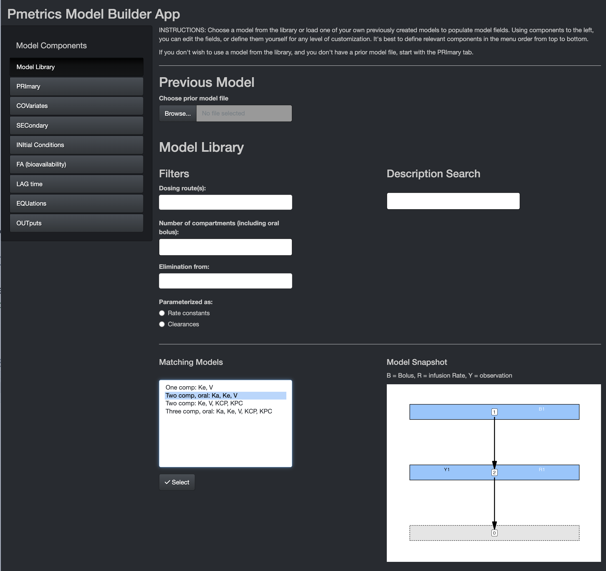
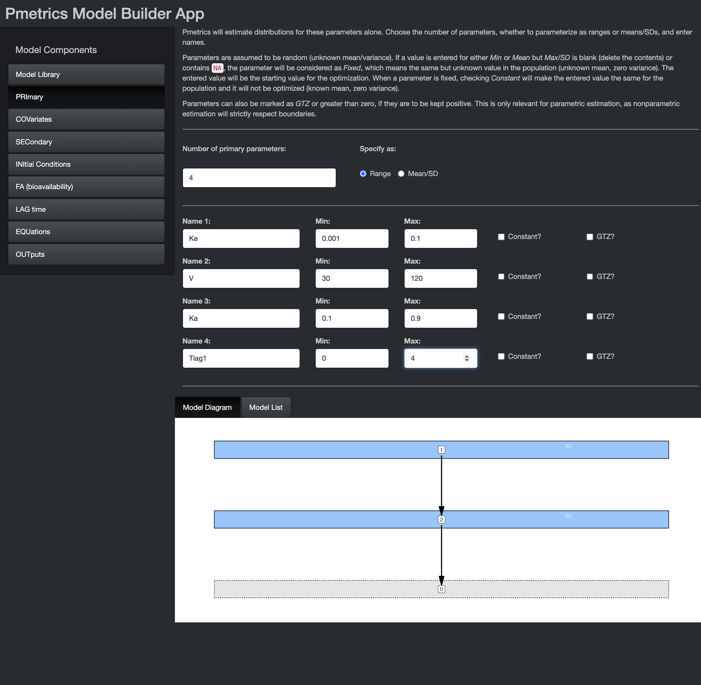
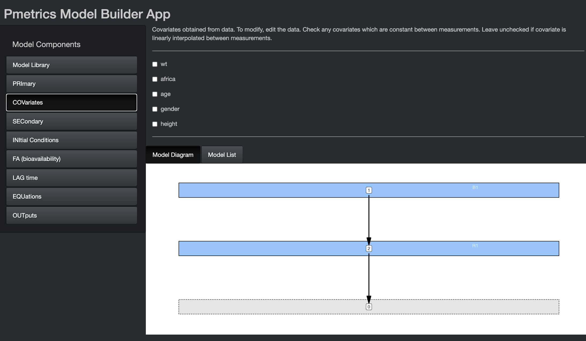
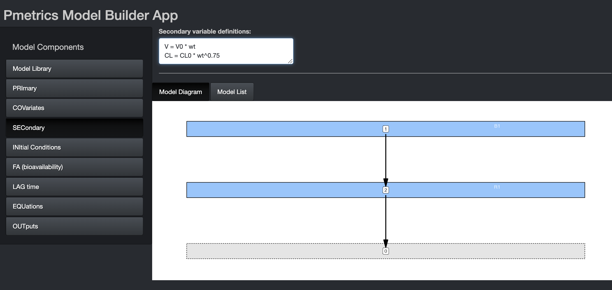
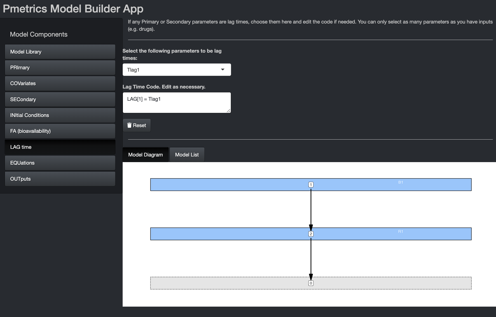
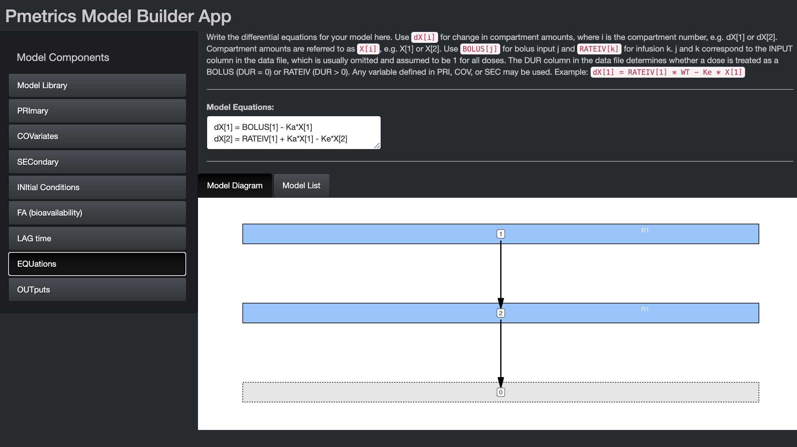
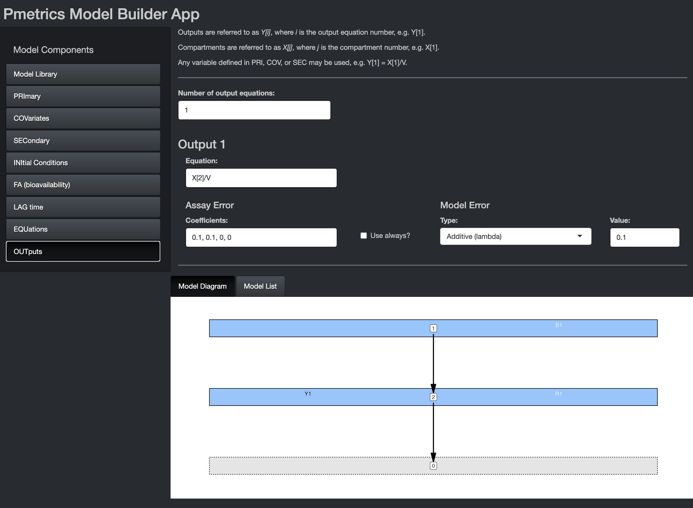
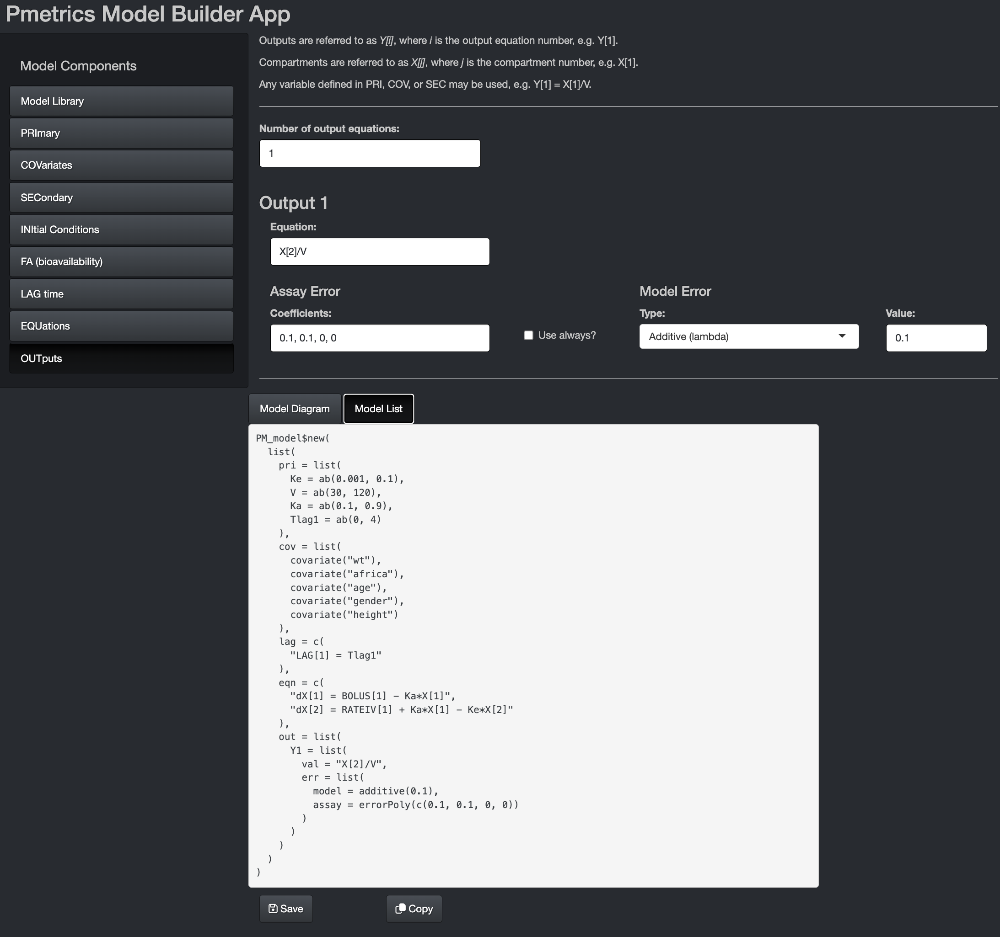

```{r setup, include=FALSE}
library(learnr)
library(Pmetrics)
library(tidyverse)
gradethis::gradethis_setup()
knitr::opts_chunk$set(echo = TRUE)
exData <- PM_data$new("data/src/ex.csv")
mod1 <- PM_model$new("data/src/model.txt")
```

# Introduction

This tutorial will introduce you to R and Pmetrics programming functions
and techniques. For any function, you can get help by typing
?function_name in the R console (the lower left window pane in RStudio).

Try getting help for plot.PM_op().

```{r function_help, exercise=TRUE}

```

<!-- ::: {#function-help-hint} -->
<!-- **Hint:** You don't need to include the parentheses when asking for -->
<!-- help. -->
<!-- ::: -->

``` {r function_help-hint}
You don't need to include the parentheses when asking for help.
```

```{r function_help-solution}
?plot.PM_op
```

```{r function_help-code-check}
gradethis::grade_code()
```

When you begin an R script you must always load Pmetrics, because the
data and functions in the package are not automatically available to you
when you start R/Rstudio. You don't need to execute the following
command in this tutorial because we've done it for you already, but you
should include it in every Pmetrics script of your own.

```{r echo = T, eval = F}
library(Pmetrics)
```

Let's get to some exercises!

## Exercise 1 - NPAG Run

### Introduction


As you develop R scripts that have your analysis, it is useful to annotate with 
comments so that you can remember what you did later! Comment lines in R begin
with "#". A script might look like this.

```{r eval = FALSE}
library(Pmetrics)

# Run 1 - tlag, ka, kel, vol
setwd("My_project/src")
dat <- PM_data$new("data.csv")
mod <- PM_model$new("model.txt")

setwd("My_project/Runs")
fit <- PM_fit$new(dat, mod)
fit$run(intern = TRUE)

run1 <- PM_load(1)
# more code...

# Run 2 - change parameter ranges.

# more code...

# Run 3...
# ...
)
```

Don't worry about the details now. We'll cover all this in the tutorial.
In your scripts, including in the above example, you will need to tell R which 
directory your files are in. This is called the "working directory" in R.

In this tutorial, you don't have to do this, but the command is:

```{r eval = F}
setwd()
```

Include the full path or path relative to your current working directory
in quotes between the parentheses. Windows users: Make sure that you
separate directories with a forward slash "/" or double backslashes
"\\\\". Unfortunately, Windows is the only OS that uses backslashes
"\\", so R conforms to Unix/Linux style.

Examples:

-   "\~/LAPKB/Pmetrics/Examples" for Mac/Linux users
-   "C:/LAPKB/Pmetrics/Examples" for Windows users

If that sets the working directory, how do you get the current working directory?

```{r}

getwd() #the current working directory of this tutorial

```

### Data objects

Pmetrics always needs data and a model, so for our run let's first
create our data object.

You can most easily create a new data object by reading a file that you
made. You can read more details on [data file format](https://lapkb.github.io/Pmetrics/articles/data.html).
Here we give you a file in the tutorial data/src folder. In
your own project directories, you can look at this file directly by
opening it in a spreadsheet program like Excel, or a text editor. To read the
file into Pmetrics, use the code below.

```{r eval = FALSE}
exData <- PM_data$new("filename") #create a new PM_data object by reading a file
```

Now, you try reading the ex.csv file from the data/src folder and call the result
exData.

```{r read_data, exercise = TRUE}

```

```{r read_data-solution}
exData <- PM_data$new("data/src/ex.csv") 
```

```{r read_data-code-check}
gradethis::grade_this_code() 
```

When you create a `PM_data` object, you see a report of any
standardizations or fixes Pmetrics attempted. In this case (of course),
everything passed. `exData` is an R6 object, which means that it
contains both *fields* containing data and *methods* to process that
data. In R6, fields and methods are accessed with the `$`.

To look at the structure of an object:

```{r names_data, exercise = TRUE}
str(exData)
```

You see the classes (`PM_data` and `R6`), and public bins which are
either functions (methods) or data (fields). Private bins are not
user-accessible, but are internal to R6 objects, often, as in this case,
to validate the object. This is the advantage of the R6 framework, which
is object oriented over the older but more common S3 framework in R.
Object oriented means that objects contain both the data and the methods
to work on that data, ensuring a more stable environment than where
functions and data are separate and therefore not necessarily
compatible.

Imagine if you have an object
`my_vector <- c("apples","pears","bananas")` and you tried to do
`mean(my_vector)`. That is the S3 way and how legacy Pmetrics worked.
Under R6, you would have an object that only accepted numerical data and
contained the function to calculate the mean, e.g. `my_R6_object$data`
and `my_R6_object$mean()`. Note that to activate methods, you still need
the parentheses, just like for functions in R.

So here is the way to see the original data field in our R6 PM_data
object called `exData`.

```{r original_data, exercise = TRUE, }
exData$data #original data
```

Or the standard data...

```{r standard_data, exercise = TRUE}
exData$standard_data #contains the standardized and validated data
```

And here's how we can summarize it.

```{r summary_data, exercise = TRUE}
exData$summary() #a method to summarize the data
```

For comparison, the same thing in the more common S3 framework in R:

```{r summary_data_legacy, exercise = TRUE}
summary(exData) #the S3 function to summarize the data
```

The output is the same, but the way of getting it differs between R6 and
S3.

Other examples of things that can be done with this object are

```{r eval = F}
exData #view the original data in the viewer
exData$print(standard = T) #view the standardized data in the viewer
exData$print(viewer = F) #view original data in console
```

You can always learn more by typing `?PM_data` into your R console.

### Model objects

The easiest way to build models is to use the Pmetrics Model Builder
App. It can't be displayed within this tutorial, but you can keep the
tutorial open while you play with the app. To launch the app, type the
following into your console: `build_model(NPex$data)`. This will start
the app with sample data that is the same as what we created with
`exData`. When you launch it, the first page you'll see is below.

Navigate with the model components sidebar.

#### Model Library

```{r echo = FALSE, out.width="75%", out.height="75%"}

```

Here you can choose from pre-existing models, either which you have
created yourself and load with the Previous Model dialogue, or from the
Pmetrics Model Library. Use the filters and description search to help
select the model you want. Matching models will update in the box at the
bottom. If you select one, you'll see a model snapshot on the right.

In the snapshots, B is for bolus inputs, R is for Rate infusions (e.g.
intravenous infusions), and Y is for observations. Arrows indicate the
flow of drug. The grey compartment 0 is the environment.

Once you choose a model, hit the "Select" button at the bottom to
populate remaining model components. Similarly, if you load a Previous
Model, model components will be appropriately populated.

**For this tutorial, choose the model with oral absorption and two
compartments as shown in the snapshot above.**

#### PRImary

```{r echo = FALSE, out.width="75%", out.height="75%"}

```

In this tab, you can choose the number and names of the primary
parameters. These are the parameters for which value probability
distributions will be estimated. You can specify initial values as
ranges or mean/SD. The mean is the mid point of a range and the SD is
1/6 of the range, i.e. 3 SD above and below the mean. If you omit the
second value for a parameter (Max or SD), the parameter will become
"fixed", i.e. unknown value but zero variance in the population. In
other words Pmetrics will estimate the value but make it the same for
the whole population. The value you provide will be the starting
estimate. If you check the constant option, it will fix the parameter to
your value for every subject and not estimate. The GTZ option keeps the
parameter positive, which is only relevant for parametric analysis,
since nonparametric will respect parameter ranges strictly.

In the bottom you see the Model Diagram and the Model List. These
dynamically build as you complete the Model Components. More about them
later.

**Make your PRImary component match the image in the tutorial.**

#### COVariates

```{r echo = FALSE, out.width="75%", out.height="75%"}

```

If you launch the Model Builder with a `PM_data` object as an argument,
the covariate tab will be pre-populated with the covariates in the data
file, as above. You can select any of them to make them piece-wise
constant, i.e. the value is held constant between measurements. If left
unchecked, covariate values will be linearly interpolated between
measurements.

**Make your COVariate component match the image in the tutorial.**

```{r quiz, echo = FALSE}

question("Which of the following covariates in a model of ceftazidime in intermittent hemodialysis would be most likely to be checked as piece-wise constant?",
         answer("weight"),
         answer("dialysis", correct = TRUE),
         answer("creatinine"),
         answer("potassium"),
         correct = "Yes, dialysis can be turned on or off with 1 or 0 values which will be constant until changed.",
         incorrect = "No, try again. This covariate should be allowed to change between measurements.",
         allow_retry = TRUE
)

```

#### SECondary

```{r echo = FALSE, out.width="75%", out.height="75%"}

```

Secondary variables are those that are defined by equations that are
combinations of primary, covariates, and other secondary variables. If
using secondary variables, define them first within this block. It is
permissible to have conditional statements, but because expressions in
this block are translated into variable declarations, expressions other
than of the form "X = function(Y)" must be on a new line, prefixed by
"&" and contain only variables which have been previously defined in the
Primary, Covariate, or Secondary blocks.

The image shows examples of secondary variable declarations without
conditions. Here are two examples of conditional secondary variables
chosen on the basis of sex. The primary variables are Vm, Vf, CLm, and
CLf.

```         
V = Vm
&IF(sex == 1) V = Vf

V = Vm
CL = CLm
&IF(sex == 1) THEN
V = Vf
CL = CLF
ENDIF
```

**Make your SECondary component blank for the tutorial.**

#### INItial conditions

In this tab you can change the default initial condition of any
compartment from 0 to something else. It can be an equation, primary or
secondary variable, or covariate. We'll discuss more about the interface
in the section on lag times.

#### FA (bioavailability)

In this tab you can change the default bioavailability of any bolus
input from 1 to something else. It can be an equation, primary or
secondary variable, or covariate. We'll discuss more about the interface
in the section on lag times.

#### LAG time

```{r echo = FALSE, out.width="75%", out.height="75%"}

```

In this tab you can change the default delay in absorption of any bolus
input from 0 to something else. It can be an equation, primary or
secondary variable, or covariate. If you wish to use any of the latter
three, select them from the drop down and the equation will
pre-populate, as shown in the image. You can edit the equation or write
your own equation. This is true for initial conditions and
bioavailability in their tabs.

**Make your LAG time component match the image in the tutorial.**

#### EQuatioNs

```{r echo = FALSE, out.width="75%", out.height="75%"}

```

Here you specify the equations that define the structural model, i.e., the
mathematical expressions that relate input (dose) to output (measurements).
Use `dX[i]` for change in compartment amounts, where i is the compartment number, 
e.g. dX[1] or dX[2]. Compartment amounts are referred to as `X[i]`, e.g. X[1] or X[2].
Use `BOLUS[j]` for bolus input j and `RATEIV[k]` for infusion k.
j and k correspond to the INPUT column in the data file, which is usually omitted and assumed to be 1 for all doses. The *DUR* column in the data file determines whether a dose is treated as a BOLUS (DUR = 0) or RATEIV (DUR > 0). Any variable defined in PRI, COV, or SEC may be used in your equations.

```{r quiz_eqn, echo = FALSE}

question_radio("Which equation would not appear in a model with absorption from an oral dose into a central
compartment, intravenous infusion into the central compartment, and distribution between
the central compartment and a peripheral compartment?",
answer("dX[1] = BOLUS[1] - Ka\\*X[1]"),
answer("dX[2] = RATEIV[1] - (Ke + KCP)\\*X[2] + KCP\\*X[3]"),
answer("dX[3] = KCP\\*X[2] - KPC\\*X[3]"),
answer("dX[4] = Ke\\*X[2]", correct = TRUE),
allow_retry = TRUE,
random_answer_order = TRUE
)

```

**Make your EQN component match the image in the tutorial.**


### OUTputs

```{r echo = FALSE, out.width="75%", out.height="75%"}

```

Output equations define the relationship between a compartment amount and a measured
value. For drugs, that will usually be in the form of X[.] divided by the volume
for that compartment, where "." is again the compartment number. Write the specific equation
in the appropriate field in this tab. Output numbers correspond to the `outeq` column
of the data file, which might be missing (and assumed to be 1) when only only one output
equation is needed.

Every output equation must have an associated set of error polynomial coefficients
to describe the assay noise associated with measuring that ouput. See the article
on [models](https://lapkb.github.io/Pmetrics/articles/models.html) for more details.
The default behavior  is to use the coefficients
in the data file if they exist, and only if absent use these coefficients here. 
The "Use always?" option overrides this default to use these coefficients regardless
of what is in the data file.

Currently, you can model residual noise as additive (lambda) or multiplicative (gamma),
with a starting value for the optimization. Alternatively, you can fix the noise term.

**Make your OUT component match the image in the tutorial.**


#### Model List

```{r echo = FALSE, out.width="75%", out.height="75%"}

```

Once you have evaluated all components of the model, you can view the complete model
list in the bottom window by selecting the tab. This contains the list version of the
model which can be copied to the clipboard and pasted in to your R script. We recommend
this approach to minimize the use of additional files, permit greater clarity in your scripts
about which model you are using, and allow you to take advantage of the `$update` method
for `PM_model` objects which changes models on the fly in R.

The alternative is to save the model list to a "model.txt" file in your current working directory. This file can be loaded in the future. To change the model, update the text file, save it, and load it into R
with another `PM_model$new()` command.


The following code creates equivalent models.

```{r}
mod1 <- PM_model$new(list(
  pri = list(
    Ka = ab(0.1, 0.9),
    Ke = ab(0.001, 0.1),
    V = ab(30, 120),
    Tlag1 = ab(0, 4)
  ),
  cov = list("WT", "AFRICA", "AGE", "GENDER", "HEIGHT"),
  lag = list("Tlag(1) = Tlag1"),
  out = list(
    Y1 = list(
      value = "X(2)/V",
      err = list(
        model = proportional(5),
        assay = c(0.02, 0.05, -0.0002, 0)
      )
    )
  )
))
```

look at it mod1

in the working directory we have another file "model.txt" that contains
the old representation of the same model we previously presented, let's
take a look at it. system("cat model.txt")

PM_model$new() also accepts the path to a model file create the same model using this file mod1b <- PM_model$new("model.txt")
mod1b

PM_model provides a method to update the different elements of a model,
for example: mod1b\$update(list( pri = list( Ka = ab(0.001, 5) ) ))
mod1b

to copy a model use the $clone() method. mod1b <- mod1$clone()

simply using mod1b \<- mod1 will cause mod1b to be changed if mod1 is
changed, as R6 objects use reference semantics. For more details you can
refer to <https://adv-r.hadley.nz/r6.html>, Section 14.4.

### Fit objects

Now we define a new fit to be run as the combination of a dataset and a
suitable model. exFit \<-
PM_fit$new(model = mod1, data = exData) mod2 <- PM_model$new("model.txt")
exFit \<- PM_fit\$new(model = "model.txt", data = exData)

Let's analyze this object exFit

there are some methods we can execute over this object, like:
exFit\$check()

To keep everything tidy, let's move to another folder specific to store
the runs notice that we didn't have to move any files... setwd(paste(wd,
"/Runs", sep = "")) exFit\$run(intern = T) execute the run with default
arguments

A terminal window will open and run; don't worry about pauses; the
program has not crashed"

After the run is complete you need get the extracted information back
into R. They will be sequentially numbered as /1, /2, /3,... in your
working directory.

One benefit of having this fit object is that it is possible to run
multiple fittings without needing to move datafiles around getwd()
list.files()

Result Object exRes \<- PM_load(1)

Create a PM_result object by reading a run folder. The "1" in the
parentheses tells Pmetrics to look in the /1 folder.

Plot the raw data using R6 with various options. Type ?plot.PM_data in
the R console for help. exRes$data$plot() exRes$data$plot(overlay = F,
xlim = c(119, 145)) exRes$data$plot(overlay = F, line = list(join = F,
pred =
exRes$pop)) exRes$data$plot(line = list(join = F, pred = exRes$post),
marker = list(color = "blue", symbol = 2))

The following are the older S3 method with plot(...) for the first two
examples You can use R6 or S3 for any Pmetrics object We will focus on
R6 as the more modern way. plot(exRes$data) plot(exRes$data, xlim =
c(119, 146), marker = list(color = "blue"))

here's a summary of the original data file; ?summary.PM_data for help
exRes$data$summary()

Plot some observed vs. predicted data. Type ?plot.PM_op in the R console
for help. exRes$op$plot() exRes$op$plot(pred.type = "pop")
exRes$op$plot(line = list(lm = list(ci = .9, color = "red"), loess = F))

The OP plot can be disaggregated into a Tidy compatible format using the
$data field (see https://www.tidyverse.org/) library(tidyverse) exRes$op$data %>% plot() exRes$op\$data
%\>% filter(pred \> 5) %\>% filter(pred \< 10) %\>% plot()

the original op object data can be accessed via exRes$op$data

see a header with the first 10 rows of the op object head(exRes$op$data,
10)

get a summary with bias and imprecision of the population predictions;
?summary.PMop for help exRes$op$summary(pred.type = "pop")

the S3 way summary(exRes\$op, pred.type = "pop")

look at the summary for the posterior predictions (default pred.type)
based on means of parameter values exRes$op$summary(icen = "mean")

Plot final population joint density information. Type ?plot.PMfinal in
the R console for help. exRes$final$plot()

add a kernel density curve exRes$final$plot(density = T)

A bivariate plot. Plotting formulae in R are of the form 'y\~x'
exRes$final$plot(Ke \~ V, marker = list(color = "red", symbol =
"diamond"), line = list(color = "purple", dash = "dash", width = 2) )

or the S3 way plot(exRes\$final)

The original final object can be accessed using exRes$final$data
names(exRes$final$data)

see the population points exRes$final$popPoints

or exRes$final$data\$popPoints

see the population mean parameter values exRes$final$popMean

see a summary with confidence intervals around the medians and the
Median Absolute Weighted Difference (MAWD); ?summary.PMfinal for help
exRes$final$summary()

Plot cycle information Type ?plot.PMcycle in the R console for help.
exRes$cycle$plot()

names of the cycle object; ?makeCycle for help names(exRes$cycle$data)

gamma/lamda value on last 6 cycles tail(exRes$cycle$data\$gamlam)

Plot covariate information. Type ?plot.PMcov in the R console for help.
Recall that plotting formulae in R are of the form 'y\~x'
exRes$cov$plot(V \~ wt) exRes$cov$data %\>% plot(V \~ wt) exRes$cov$data
%\>% filter(age \> 25) %\>% plot(V \~ wt)

exRes$cov$plot(Ke \~ age, lowess = F, reg = T, pch = 3)

Same plot but with mean Bayesian posterior parameter and covariate
values... Remember the 'icen' argument? exRes$cov$plot(V \~ wt, icen =
"mean")

When time is the x variable, the y variable is aggregated by subject. In
R plot formulae, calculations on the fly can be included using the I()
function exRes$cov$plot(I(V \* wt) \~ time)

The previous cov object can be seen via: exRes\$cov

but to access individual elements, use: exRes$cov$data[, 1:3] for
example names(exRes\$cov)

summarize with mean covariates; ?summary.PM_cov for help
exRes$cov$summary(icen = "mean")

Look at all possible covariate-parameter relationships by multiple
linear regression with forward and backward elimination - type ?PMstep
in the R console for help.
exRes$step() icen works here too.... exRes$step(icen = "median") forward
elimination only exRes\$step(direction = "forward")

EXERCISE 2 - NPAG WITH COVARIATES
---------------------------------------

Again, without copying files, let's create another run object, this time
using a model that include covariates

First clone mod1 mod2 \<- mod1\$clone()

Then update it
mod2$update(list( pri = list( V0 = ab(30, 120), V = NULL ), sec = "V = V0*(WT/55)" )) we can also make a model object by loading a file mod2b <- PM_model$new("../src/model2.txt")

exFit2 \<-
PM_fit$new(data = exData, model = mod2) You can build the PM_fit object with file sources directly, but this means that you have to copy files to the working directory, or specify paths relative to the working directory as below exFit2 <- PM_fit$new(data
= "../src/ex.csv", model = "../src/model2.txt")

exFit2$check() exFit2$run()

list.files() exRes2 \<- PM_load(2)

EXERCISE 3 - COMPARING MODELS
-------------------------------------------

Let's compare model 1 and model 2. You can compare any number of models.
Type ?PM_compare for help. PM_compare(exRes, exRes2)

EXERCISE 4 - MODEL VALIDATION
-------------------------------------------

MODEL VALIDATION EXAMPLES Example of Pmetrics visual predictive check
and prediction-corrected visual predictive check for model validation -
be sure to have executed the NPAG run above Type ?makeValid in the R
console for help. Choose wt as the covariate to bin. Accept all default
bin sizes. valid_2 \<- exRes2\$validate(limits = c(0, 3))

To see what it contains, use: valid_2

Default visual predictive check; ?plot.PM_valid for help valid_2\$plot()

or old S3 plot(valid_2)

or take advantage of the valid object being added automatically to the
result object exRes2$valid$plot()

or S3 plot(exRes2\$valid)

Generate a prediction-corrected visual predictive check; type
?plot.PMvalid in the R console for help. valid_2\$plot(type = "pcvpc")

Create an npde plot valid_2\$plot(type = "npde")

Here is another way to generate a visual predicive check... npc_2 \<-
valid_2$simdata$plot(obs = exRes2\$op, log = F, binSize = 1)

The jagged appearance of the plot when binSize=0 is because different
subjects have different doses, covariates, and observation times, which
are all combined in one simulation. Collapsing simulation times within 1
hour bins (binSize=1) smooths the plot, but can change the P-values in
the numerical predictive check below.

npc_2 ...and here is a numerical predictive check P-values are binomial
test of proportion of observations less than the respective quantile

EXERCISE 5 - SIMULATOR RUN
----------------------------------------------

The following will simulate 100 sets of parameters/concentrations using
the first subject in the data file as a template. Limits are put on the
simulated parameter ranges to be the same as in the model. The
population parameter values from the NPAG run in exercise 2 (exRes2) are
used for the Monte Carlo Simulation. simdata \<- exRes2\$sim(include =
1, limits = NA, nsim = 100)

simulate from a model with new data sim_new \<- exRes2\$sim( data =
"../src/ptaex1.csv", include = 2, limits = NA, predInt = c(120, 144,
0.5) )

sim_new\$plot(log = F)

Plot it; ?plot.PMsim for help simdata\$plot()

Simulate using multiple subjects as templates simdata2 \<-
exRes2\$sim(include = 1:4, limits = NA, nsim = 100)

Plot the third simulation simdata2\$plot(at = 3)

or in S3 plot(simdata2\$data[[3]])

Parse and combine multiple files and plot them. Note that combining
simulations from templates with different simulated observation times
can lead to unpredictable plots simdata3 \<-
exRes2$sim(include = 1:4, limits = NA, nsim = 100, combine = T) simdata3$plot()

simulate with covariates in this case we use the covariate-parameter
correlations from run 2, which are found in the cov.2 object; we
re-define the mean weight to be 50 with SD of 20, and limits of 10 to 70
kg. We fix africa, gender and height covariates, but allow age (the last
covariate) to be simulated, using the mean, sd, and limits in the
original population, since we didn't specify them. See ?SIMrun for more
help on this and the Pmetrics manual.

covariate \<- list( cov = exRes2\$cov, mean = list(wt = 50), sd =
list(wt = 20), limits = list(wt = c(10, 70)), fix = c("africa",
"gender", "height") )

now simulate with this covariate list object simdata4 \<-
exRes2\$sim(include = 1:4, limits = NA, nsim = 100, covariate =
covariate)

compare difference in simulations without covariates simulated...
PM_simlist's plot function defaults to the first simulation
simdata2\$plot()

...and with covariates simulated simdata4\$plot()

Here are the simulated parameters and covariates for the first subject's
template; note that both wt and age are simulated, using proper
covariances with simulated PK parameters simdata4$data[[1]]$parValues

look in the working directory and find the "c_simdata.csv" and
"c_simmodel.txt" files which were made when you simulated with
covariates. Compare to original "simdata.csv" and "simmoddel.txt" files
to note that simulated covariates become Primary block variables, and
are removed from the template data file.

If you want to simulate from a manually specified model and external
parameter values, use something like this. sim_ext \<-
PM_sim\$run(poppar = list(wt = 1, mean = c() cov = matrix()), data =
PM_data, model = PM_model, ... ) see ?SIMrun for help, but poppar is a
list. The first object is a vector of weights for mixture model, or 1
for a single mode. The second object is a vector of mean parameter
values, or a matrix with each row the means for a given mode. The last
object is the covariance matrix, with diagonal elements the parameter
variances. As with any simulation, data and model objects are required.

EXERCISE 6 - SAVING PMETRICS OBJECTS
------------------------------------

The following objects have methods to save them to or load them from
files: PM_fit PM_result PM_sim PM_pta

Example - save the PM_result (exRes2) to the "2" folder
exRes2$save("2/exres2.rds") rds is the recommended file extension list.files("2") copy_exRes2 <- PM_result$load("2/exres2.rds")
copy_exRes2

If you want to save multiple objects into one single file, R provides
the following functionality

save(exFit, exData, mod1, exRes, simdata, file = "2/test_drug.Rdata")
list.files("2") load("2/test_drug.Rdata")

or save.image("2/workspace.Rdata") This will save all variables in your
environment list.files("2") load("2/workspace.Rdata")

EXERCISE 7 - CONTINUING RUNS OR EXTERNAL VALIDATIONS
--------------------

Example of a run with a non-uniform density This is a good way to
continue a previous run, in this case it continues where run 1 left off
setwd(paste(wd, "/Runs", sep = ""))

note that we can supply a run number to model, data, and prior
arguments. The numbers do not have to be the same. This will copy the
appropriate files from the specified run to be used in the current run.
By specifying a prior, we are starting with the non-uniform density from
the end of the specified fun. exFit2\$run(prior = 2) exRes3 \<-
PM_load(3)

We could also generate Bayesian posterior parameter estimates for a new
population this way, and with 0 cycles: exFit3 \<-
PM_fit(data=PM_data("newPop.csv"), mod2) exFit3\$run(prior = 2, cycles =
0) This won't run because we don't have a newPop.csv file, but shows you
how it could be done.

EXERCISE 8 - EXAMPLE PARAMETRIC IT2B RUN
--------------------------------

IT2B is our parametric population parameter estimator. Population
parameter value distributions are estimated as means and covariances.

EXAMPLE IT2B run - tlag, ka, kel, vol

Run IT2B. Type ?ITrun in the R console for help. Remember how we created
a PM_fit object way back in exercise 1? Now we can use it again, but
change the engine. exFit\$run(engine = "IT2B")

Type ?PM_load in the R console for help on PM_load. If you have done
extra runs, you may be at more than 4 by now. Check your working
directory to see the highest folder number, and replace the 4 below with
that number if necessary. run4 \<- PM_load(4)

Most of the commands above work the same for IT2B but some produce
different plots.

run4$final$plot() in the following plot, we standardize the x-scales to
enable comparisons of the widths of the normal distributions of the
parameter values run4$final$plot(standardize = "all")
run4$final$plot(standardize = c("Ke", "Ka", "Tlag"))

here's a bivariate plot of IT2B population parameter value distributions
run4$final$plot(Ke \~ V)

EXERCISE 9 - PROBABILITY OF TARGET ATTAINMENT
---------------------------

Note: these can be computationally intense and take some time.

Examples of probability of target attainment analysis Be sure to have
executed the NPAG run above and used PM_load(2) in EXERCISE 2 Type
?SIMrun, ?SIMparse, ?makePTA, or ?plot.PMpta into the R console for
help.

simulate with the template data file that contains different doses Look
at ?SIMrun for help on arguments to this function, including predInt,
seed, limits, nsim.

simlist1 \<- exRes2\$sim( limits = c(0, 3), data = "../src/ptaex1.csv",
predInt = c(120, 144, 0.5), seed = rep(-17, 4) )

now simulate with covariates; make sure that you defined the covariate
object first in Exercise 5 above and have loaded the results of Exercise
2 with PM_load(2) simlist2 \<- exRes2\$sim( limits = 5, data =
"../src/ptaex1.csv", predInt = c(120, 144, 0.5), seed = rep(-17, 4),
covariate = covariate )

make the first PMpta object to calculate the time above each target for
at least 60% of the dosing interval from 120 to 144 hours. Include
labels for the simulations. ?makePTA for help define simulation labels
first simlabels \<- c("600 mg daily", "1200 mg daily", "300 mg bid",
"600 mg bid")

pta1_2 \<- PM_pta\$new( simdata = simlist1, targets = c(0.25, 0.5, 1, 2,
4, 8, 16, 32), target.type = "time", success = 0.6, start = 120, end =
144 )

pta1b_2 \<- PM_pta\$new( simdata = simlist2, simlabels = simlabels,
targets = c(0.25, 0.5, 1, 2, 4, 8, 16, 32), target.type = "time",
success = 0.6, start = 120, end = 144 )

summarize the results pta1_2$summary() pta1_2$summary(ci = 0.8)

in the summary()\$pta, simnum is the simulation (dose) number; target is
the MIC; prop.success is the proportion of the simulated profiles for
each dose/MIC that are above the success threshold (0.6); pdi.mean and
pdi.sd are the mean and standard deviation of the pharmacodynamic index
(PDI), in this case proportion of the interval \> MIC. In the \$pdi,
target and simnum are the same, but now the median and confidence
intervals (default 95%) PDI are shown. ?summary.PMpta for help

Plot the first without covariates. We didn't include simulation labels
in the makePTA command, so generics are used here, but we move it to the
bottom left; ?legend for help on arguments to supply to the legend list
argument to plot.PMpta.
pta1_2$plot(ylab = "Proportion with %T>MIC of at least 60%", grid = T, legend = list(x = "bottomleft")) pta1b_2$summary()

Plot the second with covariates simulated. Note the regimen labels are
included, but we move the legend to the bottom left. pta1b_2\$plot( ylab
= "Proportion with %T\>MIC of at least 60%", grid = T, legend = list(x =
"bottomleft") )

Now we'll define success as free auc:mic \> 100 with a free drug
fraction of 50% pta2_2 \<-
PM_pta$new( simdata = simlist2, simlabels = simlabels, targets = c(0.25, 0.5, 1, 2, 4, 8, 16, 32), free.fraction = 0.7, target.type = "auc", success = 100, start = 120, end = 144 ) summary(pta2_2) pta2_2$plot(
ylab = "Proportion with AUC/MIC of at least 100", grid = T, legend =
list(x = "bottomleft") )

success is Cmax/MIC \>=10 pta3_2 \<-
PM_pta$new( simdata = simlist2, simlabels = simlabels, targets = c(0.25, 0.5, 1, 2, 4, 8, 16, 32), target.type = "peak", success = 10, start = 120, end = 144 ) pta3_2$summary()
pta3_2\$plot(ylab = "Proportion with peak/MIC of at least 10", grid = T)

success = Cmin:MIC \> 1 pta4_2 \<-
PM_pta$new( simdata = simlist2, simlabels = simlabels, targets = c(0.25, 0.5, 1, 2, 4, 8, 16, 32), target.type = "min", success = 1, start = 120, end = 144 ) pta4_2$summary()
pta4_2\$plot(ylab = "Proportion with Cmin/MIC of at least 1", grid = T,
legend = list(x = "bottomleft"))

now plot the PDI (pharmacodynamic index) of each regimen, rather than
the proportion of successful profiles. A PDI plot is always available
for PMpta objects. pta4_2\$plot(type = "pdi", ylab = "Cmin:MIC", grid =
T)

Each regimen has the 90% confidence interval PDI around the median
curve, in the corresponding, semi-transparent color. Make the CI much
narrower... pta4_2\$plot(type = "pdi", ci = 0.1)

...or gone altogether, put back the grid, redefine the colors, and make
lines narrower pta4_2\$plot( type = "pdi", ci = 0, grid = T, line =
list( color = c("blue", "purple", "black", "brown"), width = 1 ) )

now let's repeat the analysis but simulate the distribution of MICs
using susceptibility of Staphylococcus aureus to vancomycin contained in
the mic1 dataset within Pmetrics (?mic1)

see the source with ?mic1 pta4b_2 \<-
PM_pta$new( simdata = simlist2, simlabels = c("600 mg daily", "1200 mg daily", "300 mg bid", "600 mg bid"), targets = makePTAtarget(mic1), target.type = "min", success = 1, start = 120, end = 144 ) plot it pta4b_2$plot(
grid = T, ylab = "Proportion with Cmin/MIC of at least 1", marker =
list(color = "red"), line = list(color = "black") ) pta4b_2\$plot(type =
"pdi", grid = T, ylab = "Proportion with Cmin/MIC of at least 1")

note that the plot changes since target MICs are no longer discrete
since most of the MICs are very low, the regimens all look very similar

success = concentration at time 3 hours:MIC \> 2 pta5_2 \<-
PM_pta$new( simdata = simlist2, simlabels = simlabels, targets = c(0.25, 0.5, 1, 2, 4, 8, 16, 32), target.type = 123, success = 2, start = 120, end = 144 ) pta5_2$summary()
pta5_2\$plot(ylab = "Proportion with C3/MIC of at least 1", grid = T,
legend = list(x = .3, y = 0.1))

success is trough \>10 pta6_2 \<-
PM_pta$new( simdata = simlist2, simlabels = simlabels, targets = 10, target.type = 144, success = 1, start = 120, end = 144 ) plot(pta6_2) pta6_2$summary()

EXERCISE 10 - OPTIMAL SAMPLE TIMES
--------------------------------------

calculate MM-optimal sample times for Run 2, and the 1200 mg once daily
dose in the PTA By specifying the predInt to start and stop at 120 and
144 hours, with an interval of 1 hour, we are sampling at steady state.
Including "subject 2", means only the 1200 mg once daily dose will serve
as a simulation template.

mmopt_2 \<- exRes2\$MM_opt( data = "../src/ptaex1.csv", nsamp = 2,
predInt = c(120, 140, 1), include = 2 ) see the optimal sample times and
the Bayes Risk of misclassification, which is only useful to compare
optimal sampling regimens, i.e. the absolute value is less helpful, but
is the statistic minimized by the selected optimal sample times for a
given model

mmopt_2

plot it, with the red lines indicating the optimal sample times. see
?plot.MMopt for help

plot(mmopt_2) plot(mmopt_2, line = list(color = "slategrey"), times =
list(color = "orange"))

EXERCISE 11 - ASSAY ERROR
----------------------------------------------- see ?makeErrorPoly for
more help This will let you choose the best set of C0, C1, C2, C3 for
your modeling, based on assay validation data which includes the "obs",
which are the nominal concentrations of the standards, and "sd", which
is the standard deviation of replicate measurements of each of the
standards, i.e. the inter-day and/or intra-day standard deviation

obs \<- c(0, 25, 50, 100, 250, 500, 1000, 2000, 5000) sd \<- c(0.5, 6.4,
8.6, 12, 8.6, 37.2, 60.1, 165.7, 483)

See plots.pdf, page 50 makeErrorPoly(obs = obs, sd = sd)

choose the one with the best R-squared that will never result in a
negative value for the SD

Ancillary functions
-----------------------------------------------------

Be sure to check out the help files for the following functions: \#
makeAUC() - calculate AUC from a variety of inputs. While still
available as a standalone function, it is now available as a method for
many R6 objects,

Recall we made exRes, a PM_result in Exercise 1. exRes$op$auc()
exRes$post$auc() exRes$pop$auc() exRes$data$auc(). #We also can obtain
AUCs on data objects directly.
exData$auc() #and from PM_sim and PM_simlist objects (Exercise 4) simdata1$auc()
simdata2\$auc(at = 2)

makeNCA() - non-compartmental analysis is also available as a standalone
function and a method for PM_result and PM_data objects.
exData$nca() exRes$nca()

NM2PM() - convert NONMEM data files to Pmetrics data files qgrowth() -
CDC growth charts zBMI() - CDC pediatric BMI z-scores and percentiles
ss.PK() - sample size for Phase 1 PK studies
