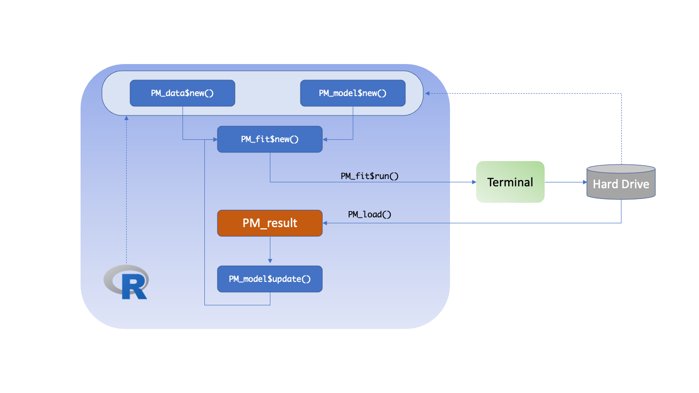

```{r, include = FALSE}
knitr::opts_chunk$set(
  collapse = TRUE,
  comment = "#>"
)
```

```{r setup, echo=F, message=F}
library(Pmetrics)
```

## General Workflow

<span class="r6">R6</span>

The general Pmetrics workflow in R6 for IT2B and NPAG is shown in the
following diagram.




The user creates the data and model objects at the top. These can come from the hard drive or from within R (dashed arrows). The model file is created in R using
the `PM_model$new()` function and the data file by `PM_data$new()`. When combined using `PM_fit$new()` and the `$run()` function
on the resulting object, the analysis is executed. At the end of the run, the hard drive will contain a new numerically named folder, e.g., 1, 2, 3, ..., that contains the files which can be loaded into R subsequently using
`PM_load(x)`, replacing `x` with the folder number. `PM_load()` is an alias for `PM_result$new()` because it creates a new `PM_result()` object which contains all the results of a run, and has many assciated methods attached to it for plotting, simulating, etc.

To change model parameters, the model object is updated via `PM_model$update()`, `PM_fit$new()` is called and then the run is executed with `$run()`. If  continuing a previous run that did not end, simply use the `$run()` and specify the run number you wish to continue as the `prior` argument to `$run()`. These scenarios are illustrated below.

```{r echo=T, eval=FALSE}
#Run 1 - ensure the data, model files are in the working directory
data1 <- PM_data$new("data.csv")
mod1 <- PM_model$new("model.txt")
fit1 <- PM_fit$new(data1, mod1)
fit1$run()
res1 <- PM_load(1) #PM_load is an alias for PM_result$new()

#Run 2 - update Ke range
mod2 <- mod1$clone #create an independent copy
mod2$update(list(pri = list(Ke = ab(0.5, 3))))
fit2 <- PM_fit$new(data1, mod2)
fit2$run()

#Run 3 - continue run 2
fit2$run(prior = 2)
```

The great advantage of R6 over Legacy is that in R6, you no longer need to spend time copying files from prior run folders, modifying them, and ensuring that they are in the working directory. After the initial creation of the data and model objects, everything can be done in R from memory, although results are still saved to hard drive for later retrieval.


<span class="legacy">Legacy</span>

The general Pmetrics workflow in Legacy for IT2B and NPAG is shown in the
following diagram. The major differences compared to R6 are:

* *Data and model* The data is always a .csv file, and the model is always a text file which must be edited to make changes. Both must be copied from a prior folder to the current working directory for every run.
* *Run.* Separate commands for NPAG and IT2B must be used, i.e. `NPrun()` and `ITrun()`.
* *Loading.* Results are loaded with `PMload()` not `PM_load()` because the former returns a collection of results all suffixed with the run number, e.g. `op.1` or `final.1` for run 1. This can lead to confusion if working on two projects at once, or uncertainty about what is actually loaded.


The user supplies the names of the data and model files as arguments to 
the run functions. R is used to specify the working directory containing these files. The analysis is executed in a terminal window by calling `NPrun()`, `ITrun()` or `ERRrun()` functions. The results can be loaded into R after the run completes using
`PMload()`. The analgous Legacy code to the R6 code above is shown here.

```{r echo=T, eval=FALSE}
#Run 1 - ensure the data, model files are in the working directory
NPrun("data.csv", "model.txt")
PMload(1) 

#Run 2 - update Ke range - edit file outside R, copy to working directory
#use same data as for run 1
NPrun(data = 1, "model2.txt")

#Run 3 - continue run 2
NPrun(data = 1, model = 1, prior = 2)
```

While there are fewer lines of R code than for R6, the edits made to create model2.txt are not recorded anywhere in R, and must be made outside R, with cumbersome file copying to ensure everything is in the working directory.
