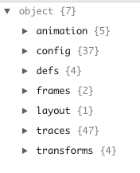
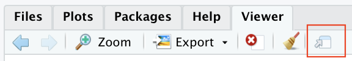

```{r, include = FALSE}
knitr::opts_chunk$set(
  collapse = TRUE,
  comment = "#>"
)
```

```{r setup, echo=F, message=F}
library(Pmetrics)
library(tidyverse)
library(plotly)
```

## Overview

As of version 2, *Pmetrics* uses the *plotly* package for most plots. Plots
made with plotly are interactive, so that moving your cursor over them
results in pop up information being displayed. A nice feature of plotly is the `ggplotly` command which takes any *ggplot* plot object and turns it into a plotly plot. This route doesn't provide complete control of plotly objects, so Pmetrics uses plotly from the ground up.

However, the documentation for plotly is a bit complex and often lacking in 
sufficient examples. This vignette attempts to orient you to the specific
aspects of plotly most relevant to Pmetrics.

## General

Plotly is based on a foundation of lists. Most plot elements are lists whose
arguments control characteristics of the elements. Pmetrics chiefly uses only
a handful of the elements.

Full descriptions of plotly elements and options to control them can be accessed
by typing `plotly::schema()` into the R console. If you have already loaded 
plotly you can just type `schema()`. You will see something like the menu below
in the Viewer tab in Rstudio.




In plotly, the [traces](#traces) items control appearance of the data. The [layout](#layout) items control everything to do with the appearance of the
axes and the legend.   

## Traces 

Pmetrics almost exclusively uses scatter traces, and those elements can be
referenced by expanding traces `r knitr::asis_output("\U25B6")` scatter 
`r knitr::asis_output("\U25B6")` attributes.

There are many such attributes, but the most commonly used and accessible to the user are line and marker.

### Line attributes

All plotly plots in Pmetrics have a `line` argument which maps to the *line* attribute 
of a plotly scatter trace. 
When Pmetrics detects a boolean argument, e.g. `TRUE` or `FALSE` it either plots
the default line or suppresses the line altogether. A good example of this is the
`line` argument to `plot.PM_op` to generate an observed vs. predicted plot. In this
function, `line` is a list of named lines that can be plotted. If *NPex* is a
*PM_result* object loaded with `PM_load()` then the default is 
`NPex$plot$op(line = list(lm = F, loess = T, ref = T))`.This means that a 
linear model (regression) will not be plotted, a loess regression will be plotted,
and a reference line with slope = 1 and intercept = 0 will also be plotted. If we
are happy with all the defaults, we simply need to call the plot method for the
*PM_op* object field in NPex.


```{r, echo = T, eval = T}
NPex$op$plot()
```

Below is a simple example of how to change the default lines plotted, but retain
the default formatting. Now a linear regression (using the R `lm` function) is plotted with a reference line, but not a loess regression.

```{r, echo = T, eval = T}
NPex$op$plot(line = list(lm = T, loess = F, ref = T))
```

The default formats for lines may differ from function to function and are indicated
in the help files. However all lines may be formatted using three arguments as a **list**.

* `color` Specify the color of the line as a character with either the
    - name: a good reference in R is to use the `colors()` function, e.g. "dodgerblue"
    - hexadecimal code: this can be searched on the web, and is specified as a character
    with leading "#" followed by 6 hexidecimal digits, two each for Red, Green, Blue, e.g. "#C0C0C0".
    Adding an extra two digits specifies transparency, with 00 fully transparent and FF fully opaque, 
    e.g. #C0C0C066".
    - a plotly function `toRGB` which takes a color name and alpha (transparency) value on a scale of 0 - 1,
    e.g., `toRGB("red", 0.5)`.
* `width` Units are pixels.
* `dash` Sets the dash style of lines. Set to a dash type string (*solid*,*dot*, *dash*, *longdash*, *dashdot*, or *longdashdot*) or a dash length list in px (eg *5px,10px,2px,2px*)


```{r, echo = T, eval = T}
NPex$op$plot(line = list(loess = list(color = "orange", dash = "dashdot", width = 2)))
```


Note the default is `lm = F` and `ref = T`, so we don't need to specify them if that's what we want.

### Marker attributes

All plotly plots in Pmetrics have a `marker` argument which maps to the *marker* attribute 
of a plotly scatter trace. 
When Pmetrics detects a boolean argument, e.g. `TRUE` or `FALSE` it either plots
the default marker or suppresses the marker altogether. A good example of this is also the
`marker` argument to `plot.PM_op` to generate an observed vs. predicted plot. In this
function, `marker` controls the plotting symbol. If *NPex* is a
*PM_result* object loaded with `PM_load()` then the default is 
`NPex$plot$op(marker = T)`.This means that the symbols will be plotted with default
formatting. If we are happy with all the defaults, we simply need to call the plot method for the
*PM_op* object field in NPex.


```{r, echo = T, eval = T}
NPex$op$plot()
```

The default formats for markers may differ from function to function and are indicated
in the help files. However all markers may be formatted using most commonly four arguments as a **list**.

* `color` Specify the color of the marker fill as a character with either the
    - name: a good reference in R is to use the `colors()` function, e.g. "dodgerblue"
    - hexadecimal code: this can be searched on the web, and is specified as a character
    with leading "#" followed by 6 hexidecimal digits, two each for Red, Green, Blue, e.g. "#C0C0C0".
    Adding an extra two digits specifies transparency, with 00 fully transparent and FF fully opaque, 
    e.g. #C0C0C066".
    - a plotly function `toRGB` which takes a color name and alpha (transparency) value on a scale of 0 - 1,
    e.g., `toRGB("red", 0.5)`.
* `size` Units are points.
* `symbol` Either a character name or the numeric value associated with the character.
See `schema()` traces `r knitr::asis_output("\U25B6")` scatter 
`r knitr::asis_output("\U25B6")` attributes `r knitr::asis_output("\U25B6")`
marker `r knitr::asis_output("\U25B6")` symbol `r knitr::asis_output("\U25B6")`
values for all the possibilities, e.g. "circle-open" is equivalent to 100, "square"
is equivalent to 1, and "diamond-open-dot" is equivalent to 302.
* `opacity` On a scale of 0 (transparent) to 1 (opaque).

Any other marker attribute is possible, including `line`, which itself is a list
to specify attributes of the outline for a marker.


```{r, echo = T, eval = T}
NPex$op$plot(marker = list(color = "slategray", size = 12, 
                           opacity = 0.5, line = list(color = "navy")))
```


## Layout

Layout layout `r knitr::asis_output("\U25B6")` layoutAttributes 
`r knitr::asis_output("\U25B6")` displays all the options for the layout. Pmetrics plot functions currently only provide access to the following layout options:
* `legend`
* `xaxis`
* `yaxis`
* `title`
Details of how each is accessed are below.

### Legend

In all relevant Pmetrics plotly plots, the argument for legend can take one of three forms:
`TRUE`, `FALSE`, or a list. The first and second options choose to include the default legend or to suppress the legend, respectively.

Specifying `legend` as a list allows for detailed formatting of the legend using
any of the attributes documented by typing `schema()` into the R console, and expanding layout `r knitr::asis_output("\U25B6")` layoutAttributes 
`r knitr::asis_output("\U25B6")` legend. These can be included as elements in the legend list.

Here's a basic legend.
```{r, echo = T, eval = T}
NPex$data$plot(legend = T)
```

...and a more complex one.
```{r, echo = T, eval = T}
NPex$data$plot(line = list(join = F, 
                           pred = list(NPex$post, color = "navy")), 
               legend = list(
                 x = 0.75,
                 y = 0.85,
                 borderwidth = 1,
                 bgcolor = "antiquewhite"
               ),
               xlim = c(119, 146))
```

### X axis and Y axis 

Several arguments in most Pmetrics plots map to plotly list elements that control the formatting of the x- and y-axes. A full list of these elements can be viewed by typing `schema()` into the R console and expanding layout `r knitr::asis_output("\U25B6")` layoutAttributes 
`r knitr::asis_output("\U25B6")` xaxis / yaxis.

* `log` When `TRUE`, maps to `yaxis = list(type = "log")` and sets the y axis to 
log scale.
* `xlim` and `ylim` If specified as vectors of length two, e.g. `xlim = c(0, 100)`,
map to `xaxis = list(range = xlim)` and the same for the y axis.
* `xlab` and `ylab` If specified as character vectors of length 1, e.g. `xlab = "Time"`,
map to `xaxis = list(title = list(text = xlab))` and the same for the y axis. However, unlike the simpler `log`, `xlim`, and `ylim` arguments, `xlab` and `ylab` can also be specified as lists to control the formatting of the axes labels. The lists follow the plotly conventions:
    - `text` The name of the axis
    - `font` The formatting of the label, itself a list:
        - `color` Color of the text
        - `family` The HTML font family, e.g. "Arial" or "Times New Roman"
        - `size` Size in points
        
If you only specify a list for `xlab` it will be applied to `ylab`. To format them independently, specify a list for both.

``` {r echo = T, eval = T}
NPex$data$plot(xlab = "Time (h)", ylab = "Rifapentine (mg/L)")
```

``` {r echo = T, eval = T}
NPex$data$plot(xlab = list(text = "Time (h)", font = list(color = "slategrey", family = "Times New Roman", size = 18)))
#notice that ylab is also formatted in the same way
```

For greater control over the axes, e.g. tick placement, coloring, etc., the "..." argument in plots is coded to pass arguments to the xaxis and yaxis lists. This allows access to any attribute. If axis attributes are passed through ... in a named list, e.g. `xaxis = list(linecolor = "red")`, then they will be specific to that axis. However, if the attributes are passed through ... directly, without inclusion in an `xaxis` or `yaxis` list, they will apply to both the axes, e.g. `$plot(...,`linecolor = "red")` will color the xaxis and yaxis lines red.

``` {r echo = T, eval = T}
NPex$data$plot(xaxis = list(linecolor = "firebrick", ticks = "inside"))
#only affects x axis since formatting within xaxis list
```


``` {r echo = T, eval = T}
NPex$data$plot(linecolor = "dodgerblue", ticks = "outside")
#formatting affects both axes since arguments are outside xaxis or yaxis lists
```

### Title

All Pmetrics plotly plots have a `title` argument which maps to the attributes controlling the text and formatting of the plot title. A full list of these elements can be viewed by typing `schema()` into the R console and expanding layout `r knitr::asis_output("\U25B6")` layoutAttributes 
`r knitr::asis_output("\U25B6")` title. These are the same as for the axes titles, i.e. `text` and `font`, plus additional attributes to control the positioning of the title. The most common will be `x` to control the horizontal placement from 0 (left) to 1 (right) of the plot, and `y` to control the vertical placement from 0 (bottom) to 1 (top). The default for `x` is 0.5 (middle) and for `y` it is "auto", which puts the bottom of the title text onto the vertical center of the top margin.

By default the title text is oriented around the `x` value automatically ("auto") via the `xanchor` attribute, but this could also be "left", "right", or "center" to make the text begin at, end at, or span the `x` value, respectively. Analogous behavior can be controlled by the `yanchor` attribute for which part of the text lines up with the `y` value: "top", "middle", or "bottom". The default is "auto".

```{r echo = T, eval = T}
NPex$data$plot(title = list(text = "Rifapentine", yanchor = "top"), ylab = "Concentration (mg/L)", xlab = "Time (h)")
```

## Shapes

Shapes in plotly are part of the layout and detailed by typing `schema()` into the R console and expanding layout `r knitr::asis_output("\U25B6")` layoutAttributes 
`r knitr::asis_output("\U25B6")` shapes `r knitr::asis_output("\U25B6")` shape. Oddly, there is no native ability in R plotly to add shapes to an existing plot,
so Pmetrics has a custom function `add_shapes` which does the job.

The workflow is to first create a plot. All Pmetrics functions return the plot object so you can either assign the plot call to a variable, e.g. `p <- plot(...)` or use the current plot via plotly's `last_plot` function, which is the default value for `add_shapes`.

Since reference lines are by far the most common shape to add, Pmetrics has a helper function called `ab_line`, which is very similar to the workflow in base R that uses the `abline` function to add a line to the current plot.

```{r echo = T, eval = T}
NPex$data$plot() %>%
  add_shapes(ab_line(h = 5, line = list(color = "green", width = 3)))
```

Note the use of the pipe operator `%>%` to pipe the plot directly into the `add_shapes` function. This is not mandatory, since `add_shapes` by default takes the current plot as its target. If you have a previously saved plot in a variable, you can add a shape any time by supplying that variable to `add_shapes`, for example `add_shapes(p, ab_line(h = 5))`.

It is possible to add other shapes, but it will require more manual effort as there are no Pmetrics helper functions to add circles, rectangles, or paths.  Here's an example of adding a circle.


```{r echo = T, eval = T}
NPex$data$plot() %>%
  add_shapes(shape = list(type = "circle", x0 = 122, x1 = 132,
                                y0 = 15, y1 = 22))
```

The values for x0 and x1 determine the left and right extent, and for y0 and y1 the bottom and top of the circle. Coordinates are absolute, unless you include `xref = "paper"` and/or `yref = "paper"` An additional line list can control formatting.

## Annotations

Here plotly does provide two functions to add annotations to plots as labels or as floating text.

`plotly::add_annotations()` will add labels to data, allowing for connection between the data point and the label by an arrow. The options are detailed by typing `?add_annotations` into the R console. However, rather than following the hyperlink there to get additional information on options, you can get more help by typing `schema()` into the R console and expanding layout `r knitr::asis_output("\U25B6")` layoutAttributes 
`r knitr::asis_output("\U25B6")` annotations `r knitr::asis_output("\U25B6")` items `r knitr::asis_output("\U25B6")`annotation.

Similarly, `plotly::add_text()` adds labels/text to a plot, but without the connecting line. The options are detailed by typing `?add_text` into the R console.  You can get more options by typing `schema()` into the R console and expanding traces `r knitr::asis_output("\U25B6")` scatter 
`r knitr::asis_output("\U25B6")` attributes `r knitr::asis_output("\U25B6")` text, textfont, and textposition. The others (textpositionsrc, textsrc, texttemplate, textemplatesrc) are more obscure and not needed.

Annotations with connecting arrows...

```{r echo = T, eval = T}
NPex$data$plot() %>%
  add_annotations(text = ~id) #the tilde tells plotly to use the contents of the id column
```


Text without arrows...

```{r echo = T, eval = T}
NPex$data$plot() %>%
  add_text(text = ~id, textposition = "top right", 
           textfont = list(color = "green", size = 12))
```

A single text item...


```{r echo = T, eval = T}
NPex$data$plot() %>%
  add_text(x = 125, y = 2, text = "<b>Limit of quantification</b>", textfont = list(size = 10)) %>%
  add_shapes(shape = ab_line(h = 1.8))
```

Notice how the tidyverse pipe `%>%` lets you string together commands. [Tidyverse](https://www.tidyverse.org) is a powerful set of libraries for R that permit methodical, advanced data manipulation. You can load it with `library(tidyverse)`. In the plot below, we return to `add_annotations` to demonstrate that it gives you more control over the formatting. Generally, this function is likely the more useful to add text pop ups or to label data. Notice the use of the html tags <b></b> to surround the text and make it bold. You can also use `<i></i>` for italics, but plotly does not support `<u></u>` for underline.

```{r echo = T, eval = T}
NPex$data$plot() %>%
  add_annotations(x = 125, y = 2, text = "<i>Limit of quantification</i>", font = list(size = 10), showarrow = F, bgcolor = "antiquewhite", bordercolor = "black") %>%
  add_shapes(shape = ab_line(h = 1.8))
```

## Exporting 

### Images 

Although the plotly team is working on methods to export plots to images via scripting, they require installation of additional components and are not yet stable. However, exporting a plotly plot to a static image can be accomplished in two ways.

The first is to select the Export button from the Viewer window in Rstudio when the desired plot is displayed. This gives the option to save the plot as a .png, .jpeg, or .tiff. You cannot save as a .pdf with this method.


The second option is to click the camera icon that appears in the top right of a plotly plot when you mouse over the plot.


This gives you the option to download and save the file as a .png.

### PDFs

To export to a .pdf, open the plot in a browser.




From there you should be able to export the image as .pdf file.